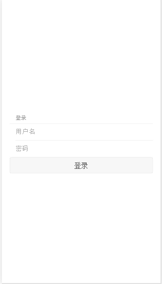
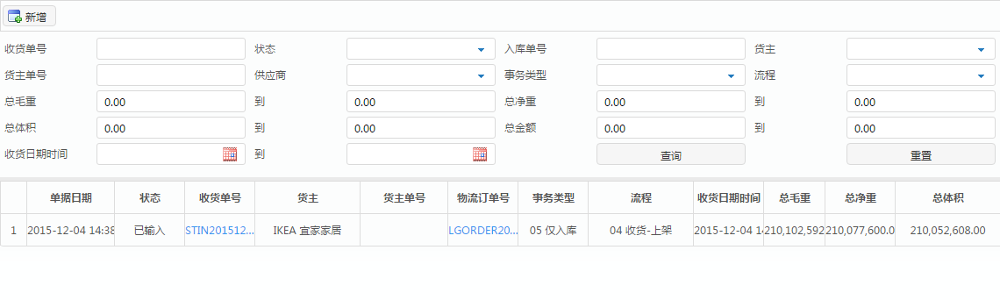
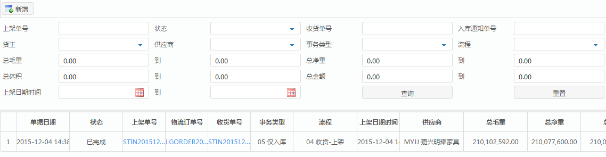
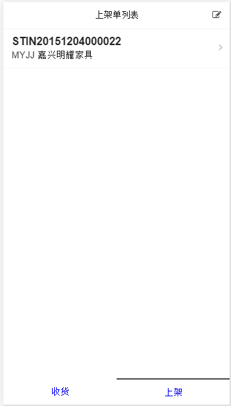
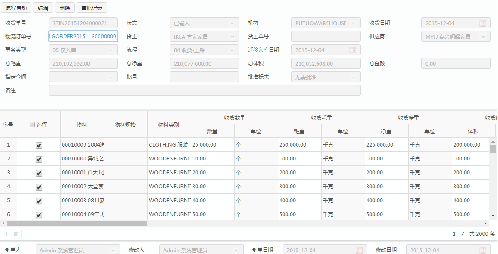
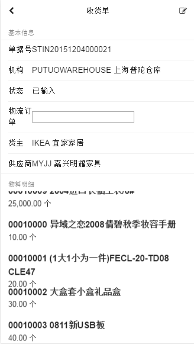

# 演示系统业务模型文档
## 演示系统介绍
> 演示系统使用Demo这个配置，主要业务和物流仓储相关，在本演示模块中
我们将使用到其中的两张单据(收货单,上架单)

## 演示系统达到的目的
1. 检验新的webapp框架的可用性
2. webapp和实际业务系统之间的集成
3. webapp在不同平台下的跨平台能力
   > 本演示模型将会在mobile browser,wechat,cordova,android,ios
   下实现不同的应用，从而检验新框架的跨平台能力
4. 演示开发步骤
   > 确认使用新框架的开发过程是否是可以让开发人员接受的
   
## 演示系统的界面用例
> 演示系统中在不同的平台下显示的效果可能不同，文档全部是以wechat
为目标平台编写的

### 登陆界面
> 在演示系统中登陆面，将会完成集成微信登陆的功能，所以在打开应用之后，
如果没有做过微信授权的话，会首先弹出微信的授权确认界面，这个界面由
微信提供，在完成授权之后，将弹出登陆界面(其实是一个用户绑定界面)，
完成登陆之后，下次再打开应用将不再需要进行登陆。

### 首页
> 首页以简单为主，由于本应用只有两个功能点，所以主页使用Tab的展现形式
通过点击下方的功能点，进行功能切换,在功能切换的时候内容部分会有一个
切换的动画效果

### 收货单列表界面
> 收货单列表界面是一个带查询部分的表单

web上的收货单

支持的操作

* 新增
> 新增一张收货单
* 查找
> 直接弹出二维码扫描界面，扫描收货单的单据号
* 刷新
> 就是界面上的查询按钮的功能
* 开打单据
> 在点击一条收货单的时候，打开这种单据

收货单列表的形式
> 现在已经完成的这个列表的形式并不是UE组提供的，等UE组确定之后需要重做

需要显示的字段
* 收货日期
* 收货单编号
* 货主

### 上架单列表界面
> 上架单列表界面时一个带查询部分的表单

web上的上架单

webapp上的上架单

支持的操作

* 查找
> 直接弹出二维码扫描界面，扫描上架单的单据号
* 刷新
> 就是界面上的查询按钮的功能
* 开打单据
> 在点击一条收货单的时候，打开这种单据

上架单的列表形式

需要显示的字段
* 上架日期
* 上架单编号
* 供应商
* 状态

### 收货单界面

web上的收货单

webapp上的收货单
> 这个界面只是示意作用和最终的结果可以不同,UE组可以根据自己的要求
对数据进行重新整合

显示的字段
> 由于是演示系统所以不需要显示太多，就示意图的中字段即可

明细列表的显示格式
>由于这个物料列表的字段非常多也并没有图片，都是文字，所以请UE组
设计一下这个格式

支持的操作(编辑的时候)
* 扫描物流订单号
> 作用是完成订单头信息的录入
* 扫描物料
> 扫描完成之后在明细中插入对应物流订单号中的对应物料，暂时不支持修改数量

