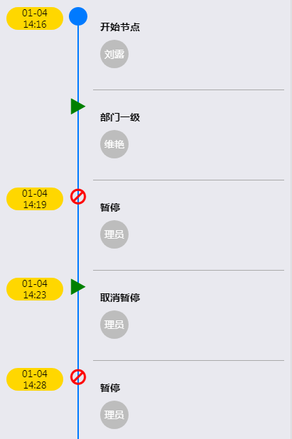

# Timeline控件
>Timeline是ListView的一个渲染控件



```javascript
"ListView1": {
    "control": "Timeline",
    "timeColumn": "finishTime",
    "titleColumn": "workItemName",
    "timeContainerStyle": {
        "backgroundColor": "gold",
        "borderRadius": 16
    },
    "circleSize": 26,
    "innerCircle": {
        "type": "element",
        "elementType": "AuditIcon",
        "elementProps": {
            "yigoid": "Audit_Result",
            "size": 26
        }
    },
    "separator": true,
    "descColumn": "userInfo",
    "imageColumn": {
        "type": "element",
        "elementType": "Avatar",
        "elementProps": {
            "yigoid": "operatorID"
        }
    }
}
```

### 属性
* timeColumn
    
    * type

        String | Control
    * 描述

        时间列，显示在最左侧
* titleColumn

    * type

        String | Control
    * 描述

        行的主内容
* timeContainerStyle

    * type

        Style
    * 描述

        时间部分的样式
* circleSize

    * type
     
        Number
    * 描述

        图标的大小
* innerCircle

    * type

        空 | Control
    * 描述

        如果是空，则显示的是一个圆,如果是一个控件描述，则用这个指定的控件替换图标位置
* separator

    * type

        Bool
    * 描述

        是否显示行之间的分割线
* descColumn
    * type

        String | Control
    * 描述

        显示在主内容下方，图片位置右边
* imageColumn
    * type

        String | Control
    * 描述

        显示在主内容下方左侧位置